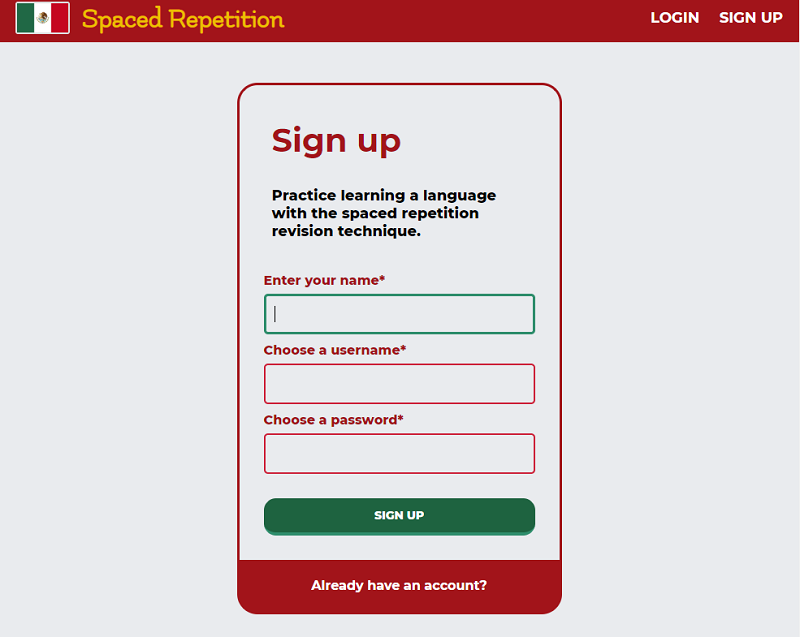
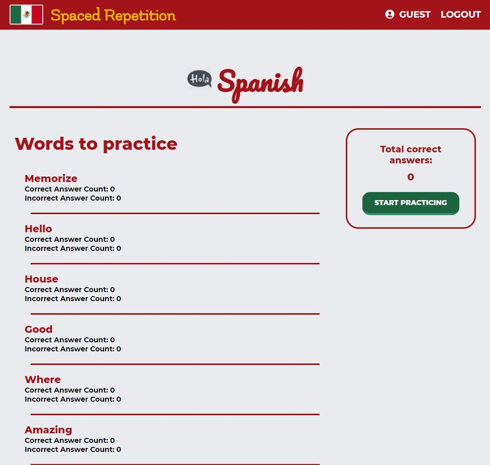
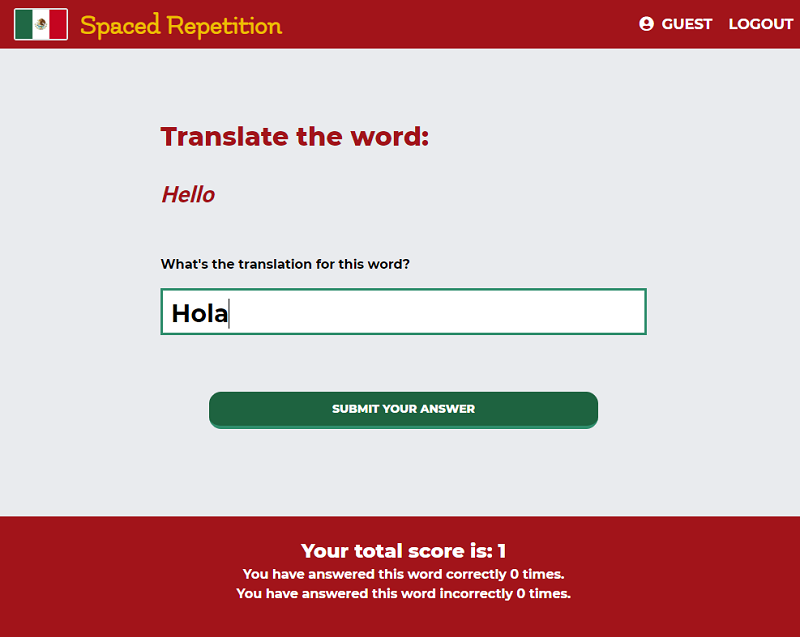
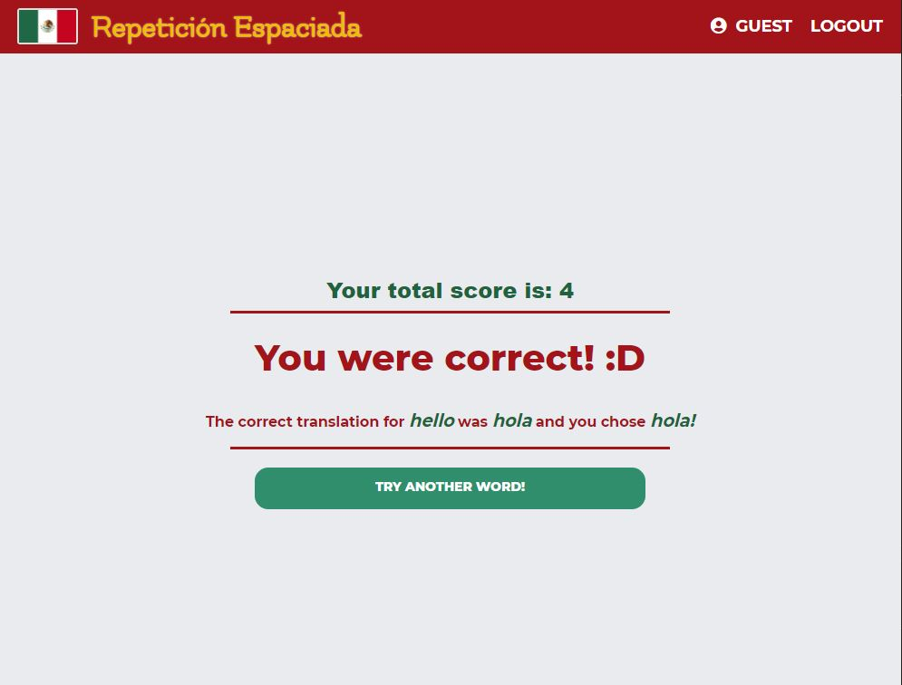
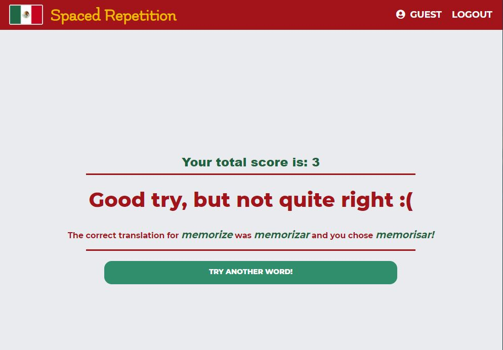
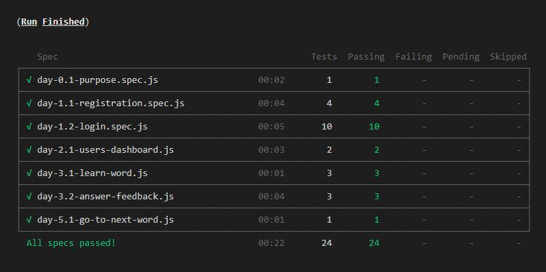

# Spaced Repetition Spanish Client

## Overview

A full-stack web application created to help users learn common Spanish vocabulary through the use of the spaced repetition learning technique. 

The most challenging part of learning a new language is repetition and retention. That is where the spaced repetition technique comes in! 

Words that users answer incorrectly will be seen more frequently than words they answer correctly until they master them all. Duolingo inspired web application with an emphasis on utilizing the spaced repetition technique to maximize Spanish vocabulary learning effectiveness. 

Users are able to securely register and login to their personal account where their personal progress will be saved. The users can view their personal progress on the dashboard and simply pick up where they last left off and continue their learning journey.

- [Live Demo](https://spaced-repetition-client.now.sh)
- [Server Repo](https://github.com/dc5will/spaced-repetition-server-william-hunter)
- [Heroku API](https://immense-harbor-42592.herokuapp.com/)

## Screenshots 











## Technologies

* Front-end: React.js, React Router, React Context, CSS3, Cypress Testing 
* Back-end: Node.js, Knex.js, Express, Mocha/Chai
* Database: PostgreSQL
* Deployment: Vercel (formerly Zeit), Heroku, Heroku Postgres
* Development: Git, GitHub

## Setup

To setup the application

1. Fork and clone the project to your machine
2. `npm install`. This will also install the application *Cypress.io* for running browser integration tests

## Scripts

This is a `create-react-app` project so `npm start` will start the project in development mode with hot reloading by default.

## Running the tests

This project uses [Cypress IO](https://docs.cypress.io) for integration testing using the Chrome browser.

Cypress has the following expectations:

- You have cypress installed (this is a devDependency of the project)
- You have your application running at http://localhost:3000.
  - You can change the address of this expectation in the `./cypress.json` file.
- Your `./src/config.js` is using http://localhost:8000/api as the `API_ENDPOINT`

To start the tests run the command:

```bash
npm run cypress:open
```

On the first run of this command, the cypress application will verify its install. Any other runs after this, the verification will be skipped.

The command will open up the Cypress application which reads tests from the `./cypress/integration/` directory. You can then run individual tests by clicking on the file names or run all tests by clicking the "run all tests" button in the cypress GUI.

Tests will assert against your running localhost client application.

You can also start all of the tests in the command line only (not using the GUI) by running the command:

```bash
npm run cypress:run
```

This will save video recordings of the test runs in the directory `./cypress/videos/`.



## Contributors

William Wong and Hunter Kreshock

